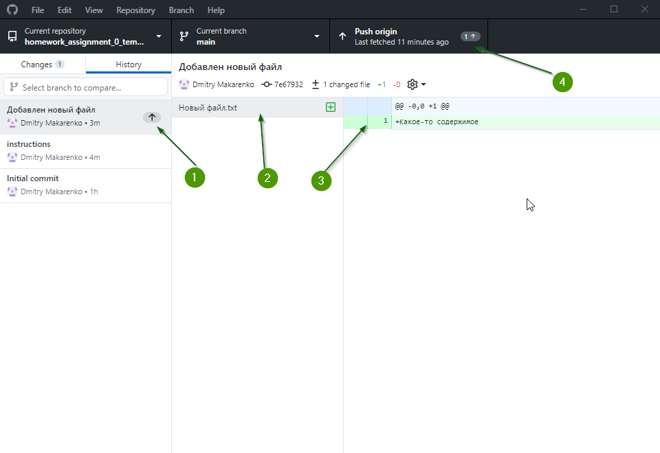

# Домашнее задание №0: Изучаем работу с Git

В этом домашнем задании нужно изучить работу с системой контроля версий Git и сервисом Github.

## Задание

1. Добавить новый файл с названием "Новый файл.txt"
1. Удалить файл "Удали меня.txt"
1. Отредактировать файл "Обо мне.txt"
4. Отправить все изменения на сервер

## Установка ПО

Для работы с репозиториями можно использовать любые программы для работы с Git. Рекомендуется использовать Github Desktop.
Проходим по адресу https://desktop.github.com , нажимаем на кнопку "Скачать" и устанавливаем.

## Клонирование репозитория

Для того, чтобы начать работу с репозиторием его необходимо перенести на свой локальный диск. Этот процесс называют клонированием репозитория (Cloning). Нажимаем на зеленую кнопку "Code" на этой странице справа и копируем адрес для клонирования, который должен быть похож на "https://github.com/MIEE-ACS/ivanov-domashnee-zadanie0.git"
и вставляем в Github Desktop нажав на кнопку "Clone a repository from the Internet" в разделе URL.

Можно выбрать куда на диске будет выгружен репозиторий:

По окончанию клонирования откроется окно просмотра состояния репозитория. Так как вы еще не внесли в репозиторий никаких изменений, то это окно будет довольно пустым. Репозиторий который не содержит никаких несохраненных изменений называют "Чистым" - Clean.

Из этого она можно открыть папку для того чтобы просмотреть что было выгружено на диск на самом деле:

## Добавление файлов

Сперва научимся добавлять файлы в репозиторий. Для этого отрываем папку с репозиторием в проводнике и создаем в ней текстовый файл с именем "Новый файл.txt". Открываем файл в блокноте в вписываем какое-то содержимое. Теперь, если файл был создан в правильной папке, в окне Github Desktop появится информация о том что был добавлен новый файл и его содержимое:

После того как мы изменили содержимое репозитория, он стал содержать несохраненные изменения. Пока еще эти изменения не зафиксированы в истории репозитория, так как эта операция выполняется вручную.

Для того чтобы зафиксировать (или как чаще говорят профессионалы Закоммитить) изменения в истории нужно отметить желаемые файлы галочкой (у нас такой файл только один) ввести описание изменения в поле Summary и нажать кнопку "Commit to main". Как только вы это сделаете, репозиторий снова перейдет в состояние "чистого" репозитория. Чтобы убедиться, что изменения были зафиксированы в истории, перейдем на вкладку History:

На этой вкладке отображается история правок (1) и самый верхний коммит - это добавление файла. Если щелкнуть по этому коммиту, то откроется подробная информация по тем изменениям которые он содержит
  - Список файлов которые изменяет данный коммит (2)
  - Изменение выбранного файла (3)

Так же, если присмотреться, то можно заметить, что текст на кнопке (4) изменился, и теперь там написано Push origin. Это значит, что наш локальный репозиторий содержит изменения, которых нет на сервере (в нашем случае на Github) и для того чтобы поделиться с миром вашим свежесозданным файлом необходимо нажать на эту самую кнопку 4. Будьте внимательны, после любых локальных коммитов необходимо их отправить на сервер нажатием на кнопку "Push origin".

## Удаление файлов

Для того, чтобы удалить какой-либо файл из репозитория нужно просто удалить этот файл в проводнике. Откроем наш репозиторий в проводнике, выберем файл "Удали меня" и нажмем кнопку del.

После этого в списке изменений отобразится, что файл "Удали меня" был удален. Теперь нужно зафиксировать изменения и отправить их на сервер (Push to origin или проще говоря "запушить").

## Редактирование файлов

Для того чтобы отредактировать файл в репозитории его необходимо отредактировать в текстовом редакторе, а затем закоммитить и запушить.

Редактируем файл и сохраняем. После этого в окне изменений Github Desktop отобразятся изменения файла. Красным будет отмечено "как было", а зеленым "как стало":

Как и прежде: коммитим и пушим.

На этом домашнее задание можно считать выполненным, но я советую поэкспериментировать с добавлением новых изменений и самостоятельно изучить работу с ветками.
